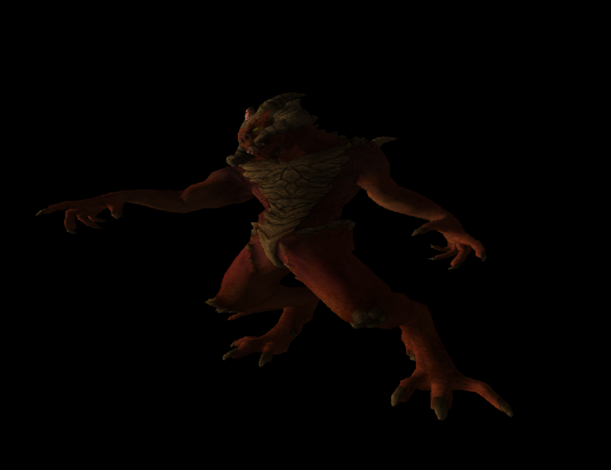

# CPUEngine

A real-time 3D graphics engine that runs entirely on the CPU — no GPU required.

Built to learn computer graphics at the lowest possible level, then push performance
as far as it can go using modern SIMD vectorization (AVX2/FMA on x86, NEON on ARM).




## Features

**Rendering**
- Software rasterizer with perspective-correct interpolation
- Z-buffer depth testing
- Frustum culling (bounding sphere)
- Wireframe and solid rendering modes
- Runtime render resolution scaling (270–1080) with nearest-neighbor upscale
- Thread pool for parallel triangle rasterization

**Shading**
- Flat shading
- Gouraud shading with per-vertex lighting
- Specular highlights (Blinn-Phong)
- Procedural shaders (stone, wood, plane/checkerboard)
- Dynamic point lights

**Post-Processing**
- SSAO (screen-space ambient occlusion) — multi-radius sampling, single-pass fused compute+apply
- Depth fog (distance-based atmospheric fog)
- Light fog (volumetric light scattering)
- Edge-detect anti-aliasing (FXAA-style)

**Engine**
- OBJ model loading with TGA textures
- Scene file format for placing models
- First-person camera with configurable FOV and clip distances
- In-engine settings menu (render, camera, fog controls)
- HUD overlay with FPS and position readout
- SIMD and scalar code paths (build with `-DSIMD=ON` or `-DSIMD=OFF`)

## Building

Requires SDL2 and CMake.

```bash
mkdir build && cd build

# SIMD enabled (recommended)
cmake -DSIMD=ON .. && make -j$(nproc)

# Scalar fallback
cmake -DSIMD=OFF .. && make -j$(nproc)
```

On macOS, use `sysctl -n hw.ncpu` instead of `nproc`.

## References

- [3D Math Primer for Graphics and Game Development, 2nd Edition](https://www.amazon.com/Math-Primer-Graphics-Game-Development/dp/1568817231)
- [Mathematics for 3D Game Programming and Computer Graphics, 3rd Edition](https://www.amazon.com/Mathematics-Programming-Computer-Graphics-Third/dp/1435458869)
- [Eric Zhang — Graphics Blog](https://lxjk.github.io/#blog)
- [ssloy — tinyrenderer](https://github.com/ssloy)
- [Fabian Giesen — Software Occlusion Culling](https://fgiesen.wordpress.com/2013/02/17/optimizing-sw-occlusion-culling-index/)
- [Karl Techno — Software Rasterizer](https://karltechno.com/posts/software-rasterizer-pt1/)

## TODO

### Rendering
- [ ] Shadow mapping
- [ ] Normal mapping
- [ ] Texture filtering (bilinear / mipmaps)
- [ ] Occlusion culling
- [ ] LOD (level of detail) mesh switching

### Physics Engine
- [ ] Rigid body dynamics (position, velocity, acceleration integration)
- [ ] Collision detection — broad phase (spatial hashing or BVH)
- [ ] Collision detection — narrow phase (GJK / SAT)
- [ ] Collision response (impulse-based resolution, restitution, friction)
- [ ] AABB and OBB bounding volumes
- [ ] Gravity and constant force fields
- [ ] Constraint solver (contact constraints, joint constraints)
- [ ] Spatial partitioning for scalable object counts
- [ ] Raycasting (for picking, line-of-sight, projectiles)
- [ ] Static vs. dynamic body types (infinite mass statics)
- [ ] Sleep / deactivation for resting bodies

### Engine
- [ ] Scene graph / transform hierarchy
- [ ] Entity-component system
- [ ] Audio
- [ ] Scripting / hot-reload
